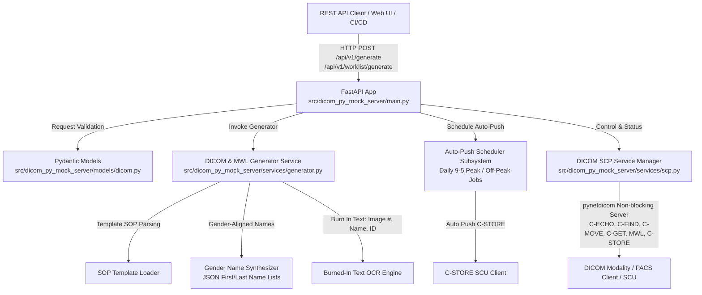

# System Design Specification (SDS) / Software Architecture Description

**Document ID:** SDS-DPMS-001  
**Project:** `dicom-py-mock-server`  
**Regulatory Standard Alignment:** IEC 62304 Clause 5.3 / 5.4, FDA 21 CFR 820.30  

---

## 1. Executive Summary & Architectural Scope

`dicom-py-mock-server` is a high-performance Python microservice designed to generate synthetic DICOM datasets and simulate DICOM SCP network services. Built on FastAPI, Pydantic, `pydicom`, and `pynetdicom`, the system supports template-based DICOM SOP and Modality Worklist (MWL) synthesis, OCR-optimized burned-in text image generation, scheduled 9-5 auto-push delivery, and headless CI/CD test automation. 

The software generates images on the fly with a modest system resource footprint, ensuring local disk storage is not overloaded during stress testing.

---

## 2. System Subsystem Architecture

---

## 3. Subsystem Breakdown & Design Contracts

### 3.1 API Subsystem (`src/dicom_py_mock_server/api/` & `main.py`)
* **`app`**: FastAPI application instance configured with Uvicorn server launcher.
* **`router`**: Defines REST endpoints:
  - `GET /health`: Health status.
  - `POST /api/v1/generate`: Triggers synthetic SOP instance creation.
  - `POST /api/v1/worklist/generate`: Triggers synthetic Modality Worklist (MWL) item creation from SOP templates.
  - `POST /api/v1/autopush/start` / `POST /api/v1/autopush/stop`: Controls automated background 9-5 peak and off-peak push scheduling.
  - `GET /api/v1/scp/status`: Returns DICOM SCP listener status.
  - `POST /api/v1/scp/start` / `POST /api/v1/scp/stop`: Lifecycle control for SCP listener.

### 3.2 Models Subsystem (`src/dicom_py_mock_server/models/`)
* **`PatientModel`**: Patient demographics (`patient_id`, `patient_name`, `patient_birth_date`, `patient_sex`).
* **`StudyModel`**: Study metadata (`study_instance_uid`, `study_date`, `study_time`, `accession_number`, `study_description`).
* **`SeriesModel`**: Series metadata (`series_instance_uid`, `modality`, `series_number`, `series_description`).
* **`WorklistTemplateModel`**: Configures template SOP baseline, scheduled procedure step specs, and gender-aligned name selection criteria (loaded from JSON lists of gender-specific first names and common US last names).
* **`MockDicomRequest`**: Validates generation specs (`num_instances`, `rows`, `columns`, OCR burned-in text options, patient/study/series specs).
* **`MockDicomResponse`**: Returns generation results, file paths, and UIDs.
* **`ScpStatusResponse`**: Returns AE Title, port, running state, and supported DICOM services (C-ECHO, C-FIND, C-MOVE, C-GET, MWL, C-STORE).

### 3.3 Generator Subsystem (`src/dicom_py_mock_server/services/generator.py`)
* **`DicomGeneratorService`**:
  - **Template-Based Synthesis**: Loads base DICOM SOP templates and synthesizes compliant DICOM datasets and Modality Worklist items. Note: The generator does NOT perform de-identification on template files. Patient Name, Patient ID, Patient Sex, Study Date & Time, DICOM UIDs (Study/Series/SOP Instance), and image pixel data are generated and replaced; all other DICOM elements (including private data elements) are passed through "as is".
  - **Gender-Aligned Name Synthesizer**: Uses JSON data files containing gender-specific first names (male/female) and common US last names to generate realistic patient names matching DICOM `PatientSex` (`M`/`F`).
  - **Burned-In Text OCR Engine**: Renders high-contrast, OCR-readable text (containing image number, patient name, and patient ID) directly into image pixel arrays using Pillow/OpenCV text drawing before standard DICOM pixel array encoding.
  - **Ephemeral On-The-Fly Generation**: Synthesizes DICOM instances in memory on the fly and streams datasets during SCP network transfers, keeping local disk storage usage minimal even during high-concurrency stress testing.

### 3.4 Auto-Push & Scheduler Subsystem (`src/dicom_py_mock_server/services/scheduler.py`)
* **`AutoPushSchedulerService`**:
  - Manages background cron/timer tasks simulating daily 9-5 peak working hour transmission bursts and lower-frequency off-peak background generation.
  - Pushes ephemeral DICOM datasets to target C-STORE SCP endpoints without requiring persistent disk caching.

### 3.5 DICOM SCP Subsystem (`src/dicom_py_mock_server/services/scp.py`)
* **`DicomScpService`**:
  - Wraps `pynetdicom.AE` (Application Entity) with configured AE Title and SCP port.
  - Registers presentation contexts for Verification (C-ECHO), Patient/Study Root Query/Retrieve (C-FIND, C-MOVE, C-GET), Modality Worklist (MWL C-FIND), and Storage (C-STORE).
  - Manages background non-blocking execution thread (`ae.start_server(..., block=False)`) for headless operation in CI/CD pipelines and stress testing.

---

## 4. Concurrency & Safety Contracts

1. **Thread Isolation**: The DICOM SCP network server and background auto-push scheduler run in background threads, preventing blockages on the main Uvicorn event loop.
2. **Strict Schema Boundaries**: All input data crossing the REST boundary is sanitized and validated by Pydantic before reaching the `pydicom` generator.
3. **Resource Protection**: Ephemeral on-the-fly DICOM generation avoids local disk saturation during prolonged stress testing or continuous 9-5 auto-push delivery.

