# DICOM Conformance Statement

**Document Title:** DICOM Conformance Statement for GoSmart.Health DICOM Mock Server  
**Software Name:** `dicom-py-mock-server`  
**Software Release:** Version 0.3.0  
**Document Release Date:** 2026-09-07  
**Standard Compliance:** NEMA PS 3.1 – PS 3.22 (DICOM Standard 2024c / 2025)  
**Document Identifier:** DCS-GSMS-030  

---

> [!IMPORTANT]
> **Intended Use & Regulatory Disclaimer**
> 
> The GoSmart.Health DICOM Mock Server (`dicom-py-mock-server`) is designed and intended strictly as a non-clinical testing, simulation, test-automation, and integration tool for medical software developers, QA engineers, and system integrators.
> 
> It is **not** a diagnostic medical device, PACS archive, or clinical image display station. It is **not** intended for primary diagnosis, patient triage, clinical treatment planning, or clinical uptime evaluation. Inquiries regarding clinical imaging deployments should be directed to [GoSmart.health](https://gosmart.health).

---

## 1. Conformance Statement Overview

The GoSmart.Health DICOM Mock Server (`dicom-py-mock-server`) is an open-source, multi-protocol medical imaging server that provides:
1. Standard DICOM Upper Layer (DIMSE) network communication over TCP/IP as both a Service Class Provider (SCP) and Service Class User (SCU).
2. DICOMweb RESTful services (QIDO-RS, WADO-RS, WADO-URI) adhering to DICOM PS 3.18.
3. Realistic, on-the-fly DICOM SOP Instance and Modality Worklist (MWL) synthesis from user-provided multi-slice templates or synthetic volumes.
4. Dynamic compression transcoding supporting JPEG Baseline (Process 1), JPEG 2000 Lossless, JPEG 2000 Lossy, RLE Lossless, and uncompressed Explicit/Implicit VR Little Endian.
5. Ingestion of clinical imaging orders via zero-dependency HL7 v2 MLLP (`ORM^O01`) and HL7 FHIR R4/R5 (`ServiceRequest`/`Bundle`) to populate and manage active Modality Worklists.

### 1.1 Network Services Supported

The following table summarizes the network services and SOP Classes supported by `dicom-py-mock-server`:

| SOP Class Name | SOP Class UID | User of Service (SCU) | Provider of Service (SCP) |
| :--- | :--- | :---: | :---: |
| **Verification** | | | |
| Verification SOP Class | `1.2.840.10008.1.1` | No | **Yes** |
| **Query/Retrieve (C-FIND)** | | | |
| Patient Root Query/Retrieve Information Model - FIND | `1.2.840.10008.5.1.4.1.2.1.1` | No | **Yes** |
| Study Root Query/Retrieve Information Model - FIND | `1.2.840.10008.5.1.4.1.2.2.1` | No | **Yes** |
| Modality Worklist Information Model - FIND | `1.2.840.10008.5.1.4.31` | No | **Yes** |
| **Query/Retrieve (C-MOVE)** | | | |
| Patient Root Query/Retrieve Information Model - MOVE | `1.2.840.10008.5.1.4.1.2.1.2` | No | **Yes** |
| Study Root Query/Retrieve Information Model - MOVE | `1.2.840.10008.5.1.4.1.2.2.2` | No | **Yes** |
| **Storage (C-STORE & Move Sub-Operations)** | | | |
| CT Image Storage | `1.2.840.10008.5.1.4.1.1.2` | **Yes** | **Yes** |
| Enhanced CT Image Storage | `1.2.840.10008.5.1.4.1.1.2.1` | **Yes** | **Yes** |
| MR Image Storage | `1.2.840.10008.5.1.4.1.1.4` | **Yes** | **Yes** |
| Enhanced MR Image Storage | `1.2.840.10008.5.1.4.1.1.4.1` | **Yes** | **Yes** |
| Secondary Capture Image Storage | `1.2.840.10008.5.1.4.1.1.7` | **Yes** | **Yes** |
| Multi-frame Grayscale Byte Secondary Capture Image Storage | `1.2.840.10008.5.1.4.1.1.7.2` | **Yes** | **Yes** |
| Multi-frame Grayscale Word Secondary Capture Image Storage | `1.2.840.10008.5.1.4.1.1.7.3` | **Yes** | **Yes** |
| Multi-frame True Color Secondary Capture Image Storage | `1.2.840.10008.5.1.4.1.1.7.4` | **Yes** | **Yes** |
| Digital X-Ray Image Storage - For Presentation | `1.2.840.10008.5.1.4.1.1.1.1` | **Yes** | **Yes** |
| Digital X-Ray Image Storage - For Processing | `1.2.840.10008.5.1.4.1.1.1.1.1` | **Yes** | **Yes** |
| Digital Mammography X-Ray Image Storage - For Presentation | `1.2.840.10008.5.1.4.1.1.1.2` | **Yes** | **Yes** |
| Digital Mammography X-Ray Image Storage - For Processing | `1.2.840.10008.5.1.4.1.1.1.2.1` | **Yes** | **Yes** |
| Ultrasound Image Storage | `1.2.840.10008.5.1.4.1.1.6.1` | **Yes** | **Yes** |
| Ultrasound Multi-frame Image Storage | `1.2.840.10008.5.1.4.1.1.3.1` | **Yes** | **Yes** |
| Nuclear Medicine Image Storage | `1.2.840.10008.5.1.4.1.1.20` | **Yes** | **Yes** |
| Positron Emission Tomography Image Storage | `1.2.840.10008.5.1.4.1.1.128` | **Yes** | **Yes** |
| X-Ray Angiographic Image Storage | `1.2.840.10008.5.1.4.1.1.12.1` | **Yes** | **Yes** |
| X-Ray Radiofluoroscopic Image Storage | `1.2.840.10008.5.1.4.1.1.12.2` | **Yes** | **Yes** |
| All Other Standard Composite Storage SOP Classes | Any valid composite storage UID | **Yes** | **Yes** |

### 1.2 Supported Transfer Syntaxes

The server supports negotiation and automatic on-the-fly transcoding across the following 6 standard Transfer Syntaxes:

| Transfer Syntax Name | Transfer Syntax UID | Supported Roles | Transcoding Engine |
| :--- | :--- | :---: | :--- |
| **JPEG 2000 Lossless** (Lossless Only) | `1.2.840.10008.1.2.4.90` | SCP / SCU / WADO-RS | `pylibjpeg-openjpeg` (OpenJPEG C library) |
| **JPEG 2000 Lossy** | `1.2.840.10008.1.2.4.91` | SCP / SCU / WADO-RS | `pylibjpeg-openjpeg` (OpenJPEG C library) |
| **RLE Lossless** | `1.2.840.10008.1.2.5` | SCP / SCU / WADO-RS | `pylibjpeg-rle` (Multi-segment PackBits) |
| **JPEG Baseline (Process 1)** | `1.2.840.10008.1.2.4.50` | SCP / SCU / WADO-RS | `Pillow` (8-bit lossy ISO/IEC 10918-1) |
| **Explicit VR Little Endian** | `1.2.840.10008.1.2.1` | SCP / SCU / WADO-RS | Native `pydicom` uncompressed binary |
| **Implicit VR Little Endian** (Default) | `1.2.840.10008.1.2` | SCP / SCU / WADO-RS | Native `pydicom` uncompressed binary |

### 1.3 Supported DICOMweb Services (PS 3.18)

| DICOMweb Service | Protocol / Specification | Supported URI Paths & Capabilities |
| :--- | :--- | :--- |
| **QIDO-RS** | PS 3.18 Section 10.6 | `GET /dicomweb/studies` `GET /dicomweb/studies/{studyUID}/series` `GET /dicomweb/series` `GET /dicomweb/studies/{studyUID}/series/{seriesUID}/instances` `GET /dicomweb/instances` *(Returns `application/dicom+json` with wildcard filtering, pagination, and sorting)* |
| **WADO-RS** | PS 3.18 Section 10.4 | `GET /dicomweb/studies/{studyUID}` `GET /dicomweb/studies/{studyUID}/series/{seriesUID}` `GET /dicomweb/studies/{studyUID}/series/{seriesUID}/instances/{instanceUID}` `GET /dicomweb/studies/{studyUID}/.../frames/{frameList}` `GET /dicomweb/studies/{studyUID}/.../metadata` `GET /dicomweb/studies/{studyUID}/.../rendered` *(Multipart DICOM, JSON metadata, raw/transcoded frames, JPEG/PNG previews)* |
| **WADO-URI** | PS 3.18 Section 9 | `GET /dicomweb/wado?requestType=WADO&studyUID=...&seriesUID=...&objectUID=...` *(Single-part Part 10 DICOM or rendered JPEG preview)* |

### 1.4 Complementary Order Ingestion Interfaces

| Protocol | Transport | Port / Endpoint | Order Type | Action |
| :--- | :--- | :--- | :--- | :--- |
| **HL7 v2.3 / v2.5** | MLLP over TCP | Port `2575` (default) | `ORM^O01` (NW, SN, XO, CA, OC, DC) | Ingests radiology orders, creates/purges MWL entries, returns MLLP `ACK^O01` (`AA`/`AE`). |
| **HL7 FHIR R4 / R5** | HTTP REST POST | `/api/v1/fhir_service_request` `/api/v1/fhir/Bundle` `/api/v1/fhir/ServiceRequest` | `Bundle`, `ServiceRequest` | Ingests FHIR imaging order resources, creates/purges MWL entries, returns JSON receipt. |

---

## 2. Table of Contents

- [1. Conformance Statement Overview](#1-conformance-statement-overview)
  - [1.1 Network Services Supported](#11-network-services-supported)
  - [1.2 Supported Transfer Syntaxes](#12-supported-transfer-syntaxes)
  - [1.3 Supported DICOMweb Services (PS 3.18)](#13-supported-dicomweb-services-ps-318)
  - [1.4 Complementary Order Ingestion Interfaces](#14-complementary-order-ingestion-interfaces)
- [2. Table of Contents](#2-table-of-contents)
- [3. Introduction](#3-introduction)
  - [3.1 Revision History](#31-revision-history)
  - [3.2 Audience](#32-audience)
  - [3.3 Remarks & Scope](#33-remarks--scope)
  - [3.4 Definitions, Terms and Abbreviations](#34-definitions-terms-and-abbreviations)
  - [3.5 References](#35-references)
- [4. Networking](#4-networking)
  - [4.1 Implementation Model](#41-implementation-model)
    - [4.1.1 Application Data Flow Diagram](#411-application-data-flow-diagram)
    - [4.1.2 Functional Definitions of Application Entities](#412-functional-definitions-of-application-entities)
    - [4.1.3 Sequencing of Real-World Activities](#413-sequencing-of-real-world-activities)
  - [4.2 AE Specifications](#42-ae-specifications)
    - [4.2.1 MOCK\_SCP Application Entity Specification](#421-mock_scp-application-entity-specification)
  - [4.3 Network Interfaces](#43-network-interfaces)
  - [4.4 Configuration](#44-configuration)
- [5. Media Interchange](#5-media-interchange)
  - [5.1 Application Data Flow](#51-application-data-flow)
  - [5.2 Supported Profiles](#52-supported-profiles)
- [6. Support of Character Sets](#6-support-of-character-sets)
- [7. Security Profiles & Synthetic Data Integrity](#7-security-profiles--synthetic-data-integrity)
  - [7.1 Security Environment & Local Sandbox Model](#71-security-environment--local-sandbox-model)
  - [7.2 Deterministic ITU-T X.667 UID Generation](#72-deterministic-itu-t-x667-uid-generation)
  - [7.3 Demographics & Suffix Collision Prevention](#73-demographics--suffix-collision-prevention)
- [8. Annexes](#8-annexes)
  - [8.1 Information Object Definitions (IOD) Module Tables](#81-information-object-definitions-iod-module-tables)
  - [8.2 Data Dictionary of Private Attributes](#82-data-dictionary-of-private-attributes)
  - [8.3 Coded Terminology and Templates](#83-coded-terminology-and-templates)
  - [8.4 Grayscale Image Consistency & OCR Burned-In Text](#84-grayscale-image-consistency--ocr-burned-in-text)
  - [8.5 DICOMweb Services Specification (PS 3.18)](#85-dicomweb-services-specification-ps-318)

---

## 3. Introduction

### 3.1 Revision History

| Document Version | Date | Software Version | Author | Description |
| :--- | :--- | :--- | :--- | :--- |
| **1.0.0** | 2026-09-07 | v0.3.0 | GoSmart.Health Engineering Team | Initial formal release of DICOM Conformance Statement covering DIMSE (C-ECHO, C-FIND, C-MOVE, C-STORE, MWL), DICOMweb (QIDO-RS, WADO-RS, WADO-URI), multi-slice template loading, transfer syntaxes (RAW, JPEG, JPEG2000, RLE), HL7 v2 MLLP, and FHIR ServiceRequest order integration. |

### 3.2 Audience

This document is intended for:
- Hospital PACS administrators, modality field service engineers, and integration specialists configuring test environments.
- Software engineers developing DICOM SCU/SCP modalities, viewing workstations, artificial intelligence (AI) inference engines, and vendor-neutral archives (VNAs).
- Regulatory compliance and quality assurance personnel reviewing system interoperability claims.

### 3.3 Remarks & Scope

This document specifies the conformance of `dicom-py-mock-server` to the DICOM Standard. Conformance does not guarantee that the mock server will satisfy all operational requirements of a specific clinical environment without prior verification in a staging network.

### 3.4 Definitions, Terms and Abbreviations

- **AE**: Application Entity
- **AET**: Application Entity Title
- **DCS**: DICOM Conformance Statement
- **DIMSE**: DICOM Message Service Element
- **FMI**: File Meta Information (DICOM Part 10 header)
- **IOD**: Information Object Definition
- **ISO**: International Organization for Standardization
- **J2K**: JPEG 2000 Image Compression
- **MLLP**: Minimal Lower Layer Protocol (HL7 framing)
- **MWL**: Modality Worklist
- **NEMA**: National Electrical Manufacturers Association
- **OCR**: Optical Character Recognition
- **PACS**: Picture Archiving and Communication System
- **PDU**: Protocol Data Unit
- **QIDO-RS**: Query based on ID for DICOM Objects by RESTful Services
- **RLE**: Run Length Encoding
- **SCP**: Service Class Provider (Server)
- **SCU**: Service Class User (Client)
- **SOP**: Service-Object Pair
- **UID**: Unique Identifier
- **VR**: Value Representation
- **WADO-RS**: Web Access to DICOM Objects by RESTful Services
- **WADO-URI**: Web Access to DICOM Persistent Objects by URI

### 3.5 References

- **NEMA PS 3.1 – PS 3.22**: Digital Imaging and Communications in Medicine (DICOM) Standard.
- **NEMA PS 3.2**: Conformance.
- **NEMA PS 3.4**: Service Class Specifications.
- **NEMA PS 3.5**: Data Structures and Encoding.
- **NEMA PS 3.6**: Data Dictionary.
- **NEMA PS 3.10**: Media Storage and File Format for Media Interchange.
- **NEMA PS 3.18**: Web Services (DICOMweb).
- **ITU-T Recommendation X.667 / ISO/IEC 9834-8**: Generation and registration of Universally Unique Identifiers (UUIDs) and their use as ASN.1 Object Identifier components.

---

## 4. Networking

### 4.1 Implementation Model

#### 4.1.1 Application Data Flow Diagram

```mermaid
flowchart TD
    subgraph External_Entities ["External Clinical Systems & SCUs"]
        MOD["Imaging Modality (SCU)"]
        PACS["PACS / VNA Archive (SCP/SCU)"]
        VIEWER["DICOMweb Viewer / Workstation"]
        EHR["Hospital EHR / RIS System"]
    end

    subgraph DPMS ["GoSmart.Health DICOM Mock Server"]
        subgraph DIMSE_AE ["MOCK_SCP Application Entity (Port 11112)"]
            ECHO_HANDLER["Verification (C-ECHO) SCP"]
            FIND_HANDLER["Query / Retrieve (C-FIND) SCP"]
            MWL_HANDLER["Modality Worklist (MWL) SCP"]
            MOVE_HANDLER["Query / Retrieve (C-MOVE) SCP"]
            STORE_SCP["Storage (C-STORE) SCP"]
            STORE_SCU["Storage (C-STORE) SCU Push"]
        end

        subgraph DICOMweb_API ["DICOMweb HTTP REST API (Port 8000)"]
            QIDO["QIDO-RS (/dicomweb/studies...)"]
            WADO_RS["WADO-RS (/dicomweb/.../frames)"]
            WADO_URI["WADO-URI (/dicomweb/wado)"]
        end

        subgraph Ingestion_Engine ["Order Ingestion Pipeline"]
            HL7_SRV["HL7 v2 MLLP Listener (Port 2575)"]
            FHIR_API["FHIR REST API (Port 8000)"]
        end

        subgraph Core_Services ["Server Core Engine"]
            MWL_SVC["MWL Generator & Active Memory Store"]
            GEN_SVC["DicomGeneratorService (Transcoder & Synthesizer)"]
            DISK_STORE[("Local Disk Storage")]
            TEMPLATES[("Multi-Slice DICOM Templates")]
        end
    end

    EHR -- "HL7 v2 ORM^O01" --> HL7_SRV
    EHR -- "FHIR ServiceRequest Bundle" --> FHIR_API
    HL7_SRV --> MWL_SVC
    FHIR_API --> MWL_SVC

    MOD -- "C-ECHO Request" --> ECHO_HANDLER
    MOD -- "MWL C-FIND Request" --> MWL_HANDLER
    MWL_HANDLER <--> MWL_SVC

    PACS -- "Study C-FIND Request" --> FIND_HANDLER
    FIND_HANDLER <--> MWL_SVC

    PACS -- "C-MOVE Request" --> MOVE_HANDLER
    MOVE_HANDLER <--> MWL_SVC
    MOVE_HANDLER --> GEN_SVC
    GEN_SVC <--> TEMPLATES
    GEN_SVC --> STORE_SCU
    STORE_SCU -- "C-STORE Sub-operations" --> PACS

    MOD -- "C-STORE Request" --> STORE_SCP
    STORE_SCP --> DISK_STORE

    VIEWER -- "QIDO Search" --> QIDO
    VIEWER -- "WADO Retrieval" --> WADO_RS
    VIEWER -- "Rendered Preview" --> WADO_URI
    QIDO <--> MWL_SVC
    QIDO <--> DISK_STORE
    WADO_RS <--> GEN_SVC
    WADO_RS <--> DISK_STORE
```

#### 4.1.2 Functional Definitions of Application Entities

- **Verification SCP (`_handle_echo`)**: Accepts presentation contexts for Verification SOP Class and returns Success (`0x0000`).
- **Query/Retrieve C-FIND SCP (`_handle_find`)**: Accepts presentation contexts for Patient Root, Study Root, and Modality Worklist Find models. Evaluates incoming query identifiers against active in-memory MWL entries and local storage records. Returns matches using status Pending (`0xFF00`) and concludes with Success (`0x0000`).
- **Query/Retrieve C-MOVE SCP (`_handle_move`)**: Accepts presentation contexts for Patient Root and Study Root Move models. Looks up destination host and port from configuration (`config.move_destinations` or requestor IP), synthesizes matching DICOM instances via `DicomGeneratorService`, yields total sub-operations count, and initiates outgoing C-STORE SCU sub-operations to the destination AE.
- **Storage C-STORE SCP (`_handle_store`)**: Accepts presentation contexts for all standard DICOM composite storage SOP classes and writes incoming datasets to Part 10 compliant files on disk under `config.storage_dir`.
- **Storage C-STORE SCU (`push_study_to_destination`)**: Initiates DICOM associations to remote Storage SCPs to transfer generated or retrieved image series, transcoding images to the peer's negotiated transfer syntax on the fly.

#### 4.1.3 Sequencing of Real-World Activities

1. **Order Creation**: An EHR sends an HL7 `ORM^O01` message over MLLP (port 2575) or POSTs a FHIR R4 `Bundle` (port 8000). The ingestion engine parses patient demographics, order numbers, and modality codes, checks template availability, creates an active MWL entry, and returns an acknowledgement (`ACK^O01` or HTTP 200).
2. **Modality Query**: An imaging modality queries the mock server via MWL C-FIND (port 11112). The server returns the active scheduled procedure step items.
3. **Image Retrieval / Push**:
   - A viewing workstation or PACS issues a C-MOVE request specifying a Study UID. The server synthesizes the study from multi-slice templates, transcode slices to the negotiated syntax, and transmits them to the destination AE via C-STORE sub-operations.
   - Alternatively, automated background schedules push completed studies during simulated business hours.
4. **DICOMweb Query & Visualization**: A web-based viewer searches for studies using QIDO-RS and retrieves multipart DICOM instances, single frames, or rendered PNG/JPEG previews using WADO-RS.

---

### 4.2 AE Specifications

#### 4.2.1 MOCK_SCP Application Entity Specification

##### 4.2.1.1 SOP Classes Supported

The `MOCK_SCP` Application Entity provides Standard Conformance to the following DICOM SOP Classes:

| SOP Class Name | SOP Class UID | SCU | SCP |
| :--- | :--- | :---: | :---: |
| Verification SOP Class | `1.2.840.10008.1.1` | No | Yes |
| Modality Worklist Information Model - FIND | `1.2.840.10008.5.1.4.31` | No | Yes |
| Patient Root Q/R Information Model - FIND | `1.2.840.10008.5.1.4.1.2.1.1` | No | Yes |
| Patient Root Q/R Information Model - MOVE | `1.2.840.10008.5.1.4.1.2.1.2` | No | Yes |
| Study Root Q/R Information Model - FIND | `1.2.840.10008.5.1.4.1.2.2.1` | No | Yes |
| Study Root Q/R Information Model - MOVE | `1.2.840.10008.5.1.4.1.2.2.2` | No | Yes |
| All Standard Composite Storage SOP Classes | *Refer to Table 1-1* | Yes | Yes |

##### 4.2.1.2 Association Policies

###### 4.2.1.2.1 General
- Maximum PDU size accepted: `65,536` bytes (configurable, default `16,384` bytes).
- Standard DICOM Upper Layer Protocol over TCP/IP.

###### 4.2.1.2.2 Number of Associations
- Supports concurrent, non-blocking associations handled via worker threads in `pynetdicom`.
- The maximum number of simultaneous associations is bounded only by system OS file descriptor limits.

###### 4.2.1.2.3 Asynchronous Nature
- Asynchronous operations window negotiation is not supported. All associations operate synchronously.

###### 4.2.1.2.4 Implementation Identifying Information
- Implementation Class UID: `1.2.826.0.1.3680043.9.7433.0.3.0`
- Implementation Version Name: `GOSMART_MS_030`

##### 4.2.1.3 Association Acceptance Policy

###### 4.2.1.3.1 Activity - Verification (C-ECHO)
- **Description**: Evaluates connectivity.
- **Accepted Presentation Context**:
  - Abstract Syntax: Verification SOP Class (`1.2.840.10008.1.1`).
  - Transfer Syntaxes: All 6 supported transfer syntaxes (prefers `ExplicitVRLittleEndian` and `ImplicitVRLittleEndian`).
- **Response Status**: `0x0000` (Success).

###### 4.2.1.3.2 Activity - Query / Worklist (C-FIND)
- **Description**: Returns active MWL records or stored study metadata.
- **Accepted Presentation Contexts**:
  - Modality Worklist Information Model - FIND (`1.2.840.10008.5.1.4.31`)
  - Study Root Q/R Information Model - FIND (`1.2.840.10008.5.1.4.1.2.2.1`)
  - Patient Root Q/R Information Model - FIND (`1.2.840.10008.5.1.4.1.2.1.1`)
- **Matching Keys Supported**:

| Matching Key | DICOM Tag | VR | Matching Type Supported |
| :--- | :--- | :---: | :--- |
| **Patient Name** | `(0010,0010)` | PN | Single value, Wildcard (`*`, `?`), Case-insensitive |
| **Patient ID** | `(0010,0020)` | LO | Single value, Wildcard, Exact |
| **Accession Number** | `(0008,0050)` | SH | Single value, Wildcard, Exact |
| **Study Instance UID** | `(0020,000D)` | UI | Single value, Exact match |
| **Series Instance UID** | `(0020,000E)` | UI | Single value, Exact match |
| **SOP Instance UID** | `(0008,0018)` | UI | Single value, Exact match |
| **Modality** | `(0008,0060)` | CS | Single value |
| **Scheduled Station AE Title** | `(0040,0001)` | AE | Single value inside `(0040,0100)` |
| **Scheduled Step Start Date** | `(0040,0002)` | DA | Single value, Range matching |
| **Query/Retrieve Level** | `(0008,0052)` | CS | `PATIENT`, `STUDY`, `SERIES`, `IMAGE` |

- **Response Status Codes**:
  - `0xFF00`: Pending (matching dataset item returned).
  - `0x0000`: Success (all matching items transmitted).
  - `0xA700`: Out of Resources.
  - `0xA900`: Identifier Does Not Match SOP Class.
  - `0xC000`: Unable to Process.

###### 4.2.1.3.3 Activity - Retrieve / Move (C-MOVE)
- **Description**: Synthesizes and moves matching studies/series to the target Move Destination AE.
- **Accepted Presentation Contexts**:
  - Study Root Q/R Information Model - MOVE (`1.2.840.10008.5.1.4.1.2.2.2`)
  - Patient Root Q/R Information Model - MOVE (`1.2.840.10008.5.1.4.1.2.1.2`)
- **Destination Resolution**:
  1. Looks up the Move Destination AE Title in `config.move_destinations`.
  2. If not defined, falls back to the calling requestor's IP address and default port `11113`.
- **Sub-Operation Workflow**:
  1. The server generates all required composite instances in memory.
  2. Establishes a secondary DICOM association to the destination AE Title as an SCU.
  3. Sends C-STORE sub-operations for each instance, automatically adapting transfer syntaxes to what the destination accepted.
  4. Returns final C-MOVE response status to the requestor.
- **Response Status Codes**:
  - `0xFF00`: Pending (sub-operation in progress).
  - `0x0000`: Success (sub-operations complete, 0 failures).
  - `0xB000`: Warning (sub-operations complete with one or more warnings).
  - `0xA701`: Refused: Out of Resources - Unable to calculate number of matches.
  - `0xA702`: Refused: Out of Resources - Unable to perform sub-operations.
  - `0xA801`: Refused: Move Destination Unknown.
  - `0xFE00`: Cancel: Sub-operations terminated due to cancel request.

###### 4.2.1.3.4 Activity - Storage (C-STORE SCP)
- **Description**: Accepts incoming DICOM Part 10 SOP instances and saves them to local disk under `config.storage_dir`.
- **Accepted Presentation Contexts**: All standard DICOM storage SOP classes configured with any of the 6 supported transfer syntaxes.
- **Response Status Codes**:
  - `0x0000`: Success.
  - `0x0110`: Processing Failure (disk write or file system error).

##### 4.2.1.4 Association Initiation Policy

###### 4.2.1.4.1 Activity - Storage (C-STORE SCU)
- **Description**: Transmits synthesized DICOM SOP instances to a remote Storage SCP during C-MOVE sub-operations or scheduled auto-pushes (`push_study_to_destination`).
- **Proposed Presentation Contexts**:
  - Proposes all standard storage SOP classes matching the modality being transferred (CT, MR, DX, CR, etc.).
  - Proposes the preferred configured transfer syntax (`config.transfer_syntax`) followed by the full prioritized fallback list.
- **Transfer Syntax Adaptation**:
  - If the peer accepts a compressed syntax (e.g. `JPEG2000Lossless`, `RLELossless`, `JPEGBaseline8Bit`), the server encodes the frame using optimized C transcoders (`openjpeg`, `pylibjpeg-rle`, `Pillow`).
  - If the peer accepts uncompressed syntax (`ExplicitVRLittleEndian`), raw pixels are transferred without compression overhead.
- **Status Evaluation**: Evaluates peer response status:
  - Success (`0x0000`), Warnings (`0xB000`, `0xB006`, `0xB007`) are counted as successful deliveries.
  - Failures log warning events with hexadecimal status codes and error details.

---

### 4.3 Network Interfaces

#### 4.3.1 Physical Network Interface
- Supports standard Ethernet and Wi-Fi network hardware via host operating system TCP/IP stack.

#### 4.3.2 Additional Network Protocols
- **HL7 v2 MLLP**: Built-in non-blocking asynchronous TCP server listening on port `2575` (default). Frames payloads using Minimal Lower Layer Protocol (MLLP) standard framing:
  - Start Block: `<SB>` = `0x0B` (VT)
  - End Block: `<EB><CR>` = `0x1C 0x0D` (FS, CR)
- **HTTP / HTTPS**: FastAPI / Uvicorn asynchronous HTTP server on port `8000` (default) serving OpenAPI 3.0 endpoints, DICOMweb REST services, and FHIR order endpoints.

#### 4.3.3 IPv4 and IPv6 Support
- Supports IPv4 (`0.0.0.0`, `127.0.0.1`) and IPv6 dual-stack sockets.

---

### 4.4 Configuration

#### 4.4.1 AE Title / Presentation Address Mapping

All parameters are configurable via environment variables (with `GOSMART_MS_` prefix or standard aliases) or `.env` files:

| Parameter | Environment Variable | Default Value | Description |
| :--- | :--- | :--- | :--- |
| **SCP AE Title** | `GOSMART_MS_SCP_AE_TITLE` `GOSMART_MS_AE_TITLE` | `GOSMART_SCP` | Local DICOM Application Entity Title |
| **SCP Port** | `GOSMART_MS_SCP_PORT` `SCP_PORT` | `11112` | DICOM Upper Layer TCP listen port |
| **HTTP Host** | `GOSMART_MS_HOST` `HOST` | `127.0.0.1` | HTTP API & DICOMweb listen host |
| **HTTP Port** | `GOSMART_MS_PORT` `PORT` | `8000` | HTTP API & DICOMweb listen port |
| **HL7 MLLP Host** | `GOSMART_MS_HL7_HOST` | `0.0.0.0` | HL7 v2 MLLP listen host |
| **HL7 MLLP Port** | `GOSMART_MS_HL7_PORT` | `2575` | HL7 v2 MLLP listen port |
| **Default Transfer Syntax** | `GOSMART_MS_TRANSFER_SYNTAX` | `JPEG2000_LOSSLESS` | Target transfer syntax for generated images |
| **Move Destinations** | `GOSMART_MS_MOVE_DESTINATIONS` | `{}` | JSON map of destination AE titles to host/port |
| **Storage Directory** | `GOSMART_MS_STORAGE_DIR` | `./data/dicom_storage` | Target path for C-STORE received datasets |
| **Templates Path** | `GOSMART_MS_TEMPLATES_PATH` | `./templates` | Directory containing multi-slice template subfolders |
| **Synthetic Mode** | `GOSMART_MS_SYNTHETIC_MODE` | `false` | Enable synthetic volume slice generation |
| **Stress Mode** | `GOSMART_MS_STRESS` | `false` | Enable single-frame compression cloning |
| **MWL Window (Hours)** | `GOSMART_MS_MWL_WINDOW_HR` | `24` | Retention window for active worklist entries |
| **MWL Peak Hourly Rate** | `GOSMART_MS_MWL_RATE_PER_HR` | `12.0` | New MWL entries generated per hour (9am-5pm) |
| **Patient Suffix** | `GOSMART_MS_PATIENT_SUFFIX` | `_GSH` | Suffix appended to patient names |
| **Physician Suffix** | `GOSMART_MS_PN_SUFFIX` | `_GSH` | Suffix appended to physician names |
| **Institution Name** | `GOSMART_MS_INSTITUTION_NAME` | `GO SMART CLINIC` | Default Institution Name `(0008,0080)` |
| **ID Prefix** | `GOSMART_MS_ID_PREFIX` | `GSH-` | Prefix for Patient ID and Accession Number |

---

## 5. Media Interchange

### 5.1 Application Data Flow

The server supports off-line media interchange and file generation via its REST API:
- `POST /api/v1/generate`: Generates synthetic Part 10 DICOM files into local disk folders.
- `POST /api/v1/generate_raw`: Generates raw/custom DICOM instances with specific pixel parameters.
- Files conform to DICOM Part 10 with a 128-byte preamble, `'DICM'` prefix, and explicit File Meta Information headers.

### 5.2 Supported Profiles

- **General Purpose Media Storage**: Supports writing composite image files compatible with `STD-GEN-CD`, `STD-GEN-DVD`, and `STD-GEN-USB` file-set profiles.

---

## 6. Support of Character Sets

The mock server provides full support for the following character sets:
- **Default Character Repertoire**: ASCII (7-bit).
- **ISO-IR 100**: Latin Alphabet No. 1 (ISO 8859-1).
  - Explicitly set in tag `(0008,0005)` `SpecificCharacterSet = "ISO_IR 100"`.
  - Supports Western European accented characters in patient names, physician names, and study descriptions.

---

## 7. Security Profiles & Synthetic Data Integrity

### 7.1 Security Environment & Local Sandbox Model
- The mock server is designed to operate within protected local subnets or containerized CI/CD sandbox environments.
- Network endpoints (DIMSE, HTTP, HL7) do not implement TLS encryption by default. Production network deployments must place the server behind a secure reverse proxy (e.g. Nginx, Envoy) with TLS termination.

### 7.2 Deterministic ITU-T X.667 UID Generation
To guarantee strict DICOM conformance and eliminate collisions without exposing Protected Health Information (PHI), all DICOM UIDs are generated according to ITU-T Recommendation X.667 / ISO/IEC 9834-8 and DICOM PS 3.5 Annex B.2:
- Root Prefix: `2.25.`
- Format: `2.25.<decimal-128bit-integer>` (maximum length 44 characters, well within the 64-character limit for VR `UI`).
- Hashing Algorithm: UUIDv5 (SHA-1 over persistent namespace `GOSMART_MS_NAMESPACE_UUID`) or UUIDv3 (MD5).
- Deterministic Hierarchy:
  $$\text{StudyUID} = \text{hash}(\text{Namespace}, \text{PatientName} + \text{PatientID} + \text{Accession})$$
  $$\text{SeriesUID} = \text{hash}(\text{Namespace}, \text{StudyUID} + \text{SeriesNumber})$$
  $$\text{SOPInstanceUID} = \text{hash}(\text{Namespace}, \text{SeriesUID} + \text{InstanceNumber})$$

### 7.3 Demographics & Suffix Collision Prevention
- Synthetic patient names are generated with a configurable suffix (default `_GSH`, e.g., `SMITH_GSH^JOHN`) and MRNs with a prefix (default `GSH-`, e.g., `GSH-MRN-123456`).
- Physician names (Referring, Performing, Reading) are generated with `_GSH` suffixes (e.g., `TAYLOR_GSH^MICHAEL^MD`).
- In non-synthetic mode, original template Study Descriptions are preserved, while in synthetic mode, realistic descriptions aligned with modality clinical protocols are generated.

---

## 8. Annexes

### 8.1 Information Object Definitions (IOD) Module Tables

The table below describes the common modules and tags present in synthesized CT, MR, and secondary capture SOP instances:

| Module | Attribute Name | Tag | VR | Description / Generation Rule |
| :--- | :--- | :---: | :---: | :--- |
| **Patient** | Patient's Name | `(0010,0010)` | PN | Synthetic gender-aligned or imported name (e.g. `DOE_GSH^JOHN`) |
| | Patient ID | `(0010,0020)` | LO | Unique identifier prefixed with `GSH-` |
| | Patient's Birth Date | `(0010,0030)` | DA | Realistic birth date formatted `YYYYMMDD` |
| | Patient's Sex | `(0010,0040)` | CS | `"M"`, `"F"`, or `"O"` |
| **General Study** | Study Date | `(0008,0020)` | DA | Synchronized with MWL Scheduled Procedure Step Start Date |
| | Study Time | `(0008,0030)` | TM | Synchronized with MWL Scheduled Procedure Step Start Time |
| | Accession Number | `(0008,0050)` | SH | Order accession number |
| | Referring Physician's Name | `(0008,0090)` | PN | Assigned from physician pool or HL7/FHIR order |
| | Study Description | `(0008,1030)` | LO | Native template description or modality-aligned protocol |
| | Name of Physician Reading Study | `(0008,1060)` | PN | Assigned reading physician |
| | Study Instance UID | `(0020,000D)` | UI | Deterministic ITU-T X.667 `2.25.<u128>` UID |
| **General Series** | Modality | `(0008,0060)` | CS | `"CT"`, `"MR"`, `"DX"`, `"CR"`, `"US"`, etc. |
| | Series Description | `(0008,103E)` | LO | Descriptive series name (e.g. `"CT Chest Axial"`) |
| | Performing Physician's Name | `(0008,1050)` | PN | Assigned performing physician |
| | Series Instance UID | `(0020,000E)` | UI | Deterministic `2.25.<u128>` derived from Study UID |
| | Series Number | `(0020,0011)` | IS | Sequential integer (default `1`) |
| **General Equipment** | Institution Name | `(0008,0080)` | LO | Configurable institution name (default `"GO SMART CLINIC"`) |
| | Station Name | `(0008,1010)` | SH | Scheduled or generating station identifier |
| **Image Pixel** | Rows | `(0028,0010)` | US | Image matrix height (typically `512` or `256`) |
| | Columns | `(0028,0011)` | US | Image matrix width (typically `512` or `256`) |
| | Bits Allocated | `(0028,0100)` | US | `16` (for CT/MR/RLE/J2K) or `8` (for JPEG Baseline) |
| | Bits Stored | `(0028,0101)` | US | `12` or `16` (CT/MR), `8` (JPEG Baseline) |
| | High Bit | `(0028,0102)` | US | `BitsStored - 1` |
| | Pixel Representation | `(0028,0103)` | US | `0` (unsigned) or `1` (2's complement signed for CT) |
| | Samples per Pixel | `(0028,0002)` | US | `1` (Monochrome) |
| | Photometric Interpretation | `(0028,0004)` | CS | `"MONOCHROME2"` |
| | Pixel Data | `(7FE0,0010)` | OB/OW | Encapsulated or native pixel byte array |
| **SOP Common** | SOP Class UID | `(0008,0016)` | UI | Matches storage SOP class (e.g. CT Image Storage) |
| | SOP Instance UID | `(0008,0018)` | UI | Deterministic `2.25.<u128>` derived from Series UID |
| | Instance Number | `(0020,0013)` | IS | Sequential slice index `1..N` |
| | Specific Character Set | `(0008,0005)` | CS | `"ISO_IR 100"` |
| | Instance Creation Date / Time | `(0008,0012)/(0013)`| DA/TM | Synchronized creation timestamp |

### 8.2 Data Dictionary of Private Attributes

The mock server does **not** generate private attributes. All generated tags belong strictly to standard DICOM PS 3.6 data dictionaries.

### 8.3 Coded Terminology and Templates

Modality codes adhere to standard PS 3.16 CID 29 (Acquisition Modality): `CT`, `MR`, `DX`, `CR`, `US`, `NM`, `PT`, `XA`, `RF`.

### 8.4 Grayscale Image Consistency & OCR Burned-In Text

- In synthetic mode, images feature a high-contrast top-left demographic header and a bottom-half ramp gradient spanning full dynamic range ($0$ to $4095$ for 12-bit, $0$ to $255$ for 8-bit).
- Text lines specify `Patient Name`, `Patient ID`, `Study Date/Time`, and `Image: N/M`, rendered in crisp sans-serif glyphs optimized for optical character recognition (OCR) test harnesses.
- In stress mode, the slice number overlay is suppressed to permit instantaneous byte-identical cloning of compressed payloads.

### 8.5 DICOMweb Services Specification (PS 3.18)

#### 8.5.1 QIDO-RS Parameters & Responses
- Media Type: `application/dicom+json`
- Supports query filtering on: `PatientID`, `PatientName`, `AccessionNumber`, `StudyDate`, `ModalitiesInStudy`, `StudyInstanceUID`, `SeriesInstanceUID`, `SOPInstanceUID`, `limit`, and `offset`.

#### 8.5.2 WADO-RS Retrieve Services
- Media Types:
  - Full DICOM Instances: `multipart/related; type="application/dicom"`
  - Single Frames: `multipart/related; type="image/jp2"`, `type="image/jpeg"`, `type="image/rle"`, `type="application/octet-stream"`
  - Metadata: `application/dicom+json`
  - Rendered Views: `image/jpeg`, `image/png`
- Dynamic Transfer Syntax Negotiation: Supports standard semicolon- and comma-delimited `Accept` headers (e.g. `multipart/related; type="application/dicom"; transfer-syntax=1.2.840.10008.1.2.4.90`) as well as query parameters (`?transferSyntax=...`).

