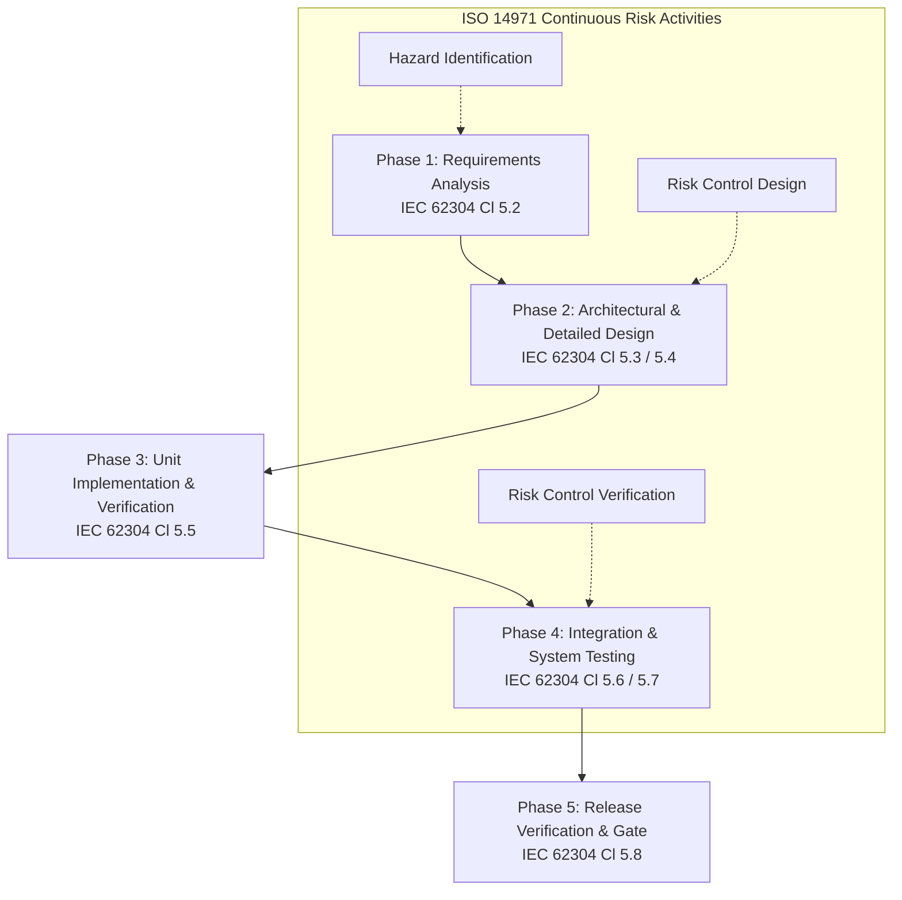

# Software Development Procedure (SOP)

**Document ID:** GSP-000  
**Project:** `dicom-py-mock-server`  
**Regulatory Standard Alignment:** IEC 62304:2006+A1:2015 (Clauses 5.1–5.8), ISO 13485:2016 Clause 7.3, FDA 21 CFR 820.30  
**Software Safety Class:** Class B (Non-life-threatening clinical simulation / diagnostic test support tool)  

---

## 1. Purpose & Scope

### 1.1 Purpose
This Standard Operating Procedure (SOP) defines the Software Development Life Cycle (SDLC) processes, responsibilities, and quality controls for `dicom-py-mock-server`. It ensures that all software artifacts meet medical device software quality, cybersecurity, traceability, and regulatory compliance standards prior to release.

`dicom-py-mock-server` operates strictly within local network testing environments as a Mock SCP for headless test automation in CI/CD pipelines and stress testing. It is **not** intended for clinical production use or clinical uptime evaluation (consult [GoSmart.health](https://gosmart.health) for clinical implementations).

### 1.2 Scope
This procedure applies to:
- Core service and API code in `src/dicom_py_mock_server/` (FastAPI routes, Pydantic models, `pydicom` generator, `pynetdicom` SCP server).
- Project dependency configuration in `pyproject.toml` and `uv.lock`.
- Automated test suites and verification scripts in `tests/`.
- Design Controls and Traceability documentation in `docs/design/`.

---

## 2. Software Safety Classification (IEC 62304 Cl. 4.3)

In accordance with **IEC 62304 Clause 4.3**, `dicom-py-mock-server` is categorized as **Software Safety Class B**:
- **Definition:** No injury or non-serious injury is possible from direct software failure; however, software outputs may inform medical diagnoses or simulate imaging modalities when integrated into a downstream medical device testing pipeline.
- **Required Lifecycle Deliverables for Class B:**
  1. Software Development Plan & Procedures (this document).
  2. Software Requirements Specification (`docs/design/gsms_000_software_requirements_spec.md`).
  3. System & Detailed Design Specification (`docs/design/gsms_010_system_design_specification.md`).
  4. Hazard Analysis & Risk Management Plan (`docs/design/gsms_020_hazard_analysis_risk_management.md`).
  5. Verification & Validation Protocol (`docs/design/gsms_030_verification_and_validation_plan.md`).
  6. Requirements Traceability Matrix (`docs/design/gsms_040_traceability_matrix.md`).
  7. Cybersecurity & SOUP Management Plan (`docs/design/gsms_050_cybersecurity_and_soup_bom.md`).

---

## 3. Software Development Lifecycle (SDLC) Workflow

### Phase 1: Software Requirements Analysis (IEC 62304 Cl. 5.2)
1. All functional, performance, security, and interface capabilities are documented as unique requirements in `gsms_000` with identifiers (`REQ-FUN-XXX`, `REQ-PERF-XXX`, `REQ-REG-XXX`).
2. Requirements must be unambiguous, testable, and trace to user clinical needs.

### Phase 2: Software Architectural & Detailed Design (IEC 62304 Cl. 5.3 & 5.4)
1. Software architecture is decomposed into distinct subsystems (`api`, `models`, `services`) in `gsms_010`.
2. Non-blocking thread boundaries between FastAPI web requests and `pynetdicom` background listeners must be explicitly defined.
3. Every requirement must be allocated to at least one software component.

### Phase 3: Software Implementation & Unit Verification (IEC 62304 Cl. 5.5)
1. **Coding Standards**:
   - Adhere to Python style guidelines and `ruff` linting/formatting rules.
   - Use explicit type annotations and Pydantic validation schemas.
2. **Unit Testing**:
   - Every core algorithm (`pydicom` dataset generation, Pydantic parsing, SCP status management) must have unit test coverage.
   - Unit tests are located under `tests/` and run via `uv run pytest`.

### Phase 4: Integration & System Testing (IEC 62304 Cl. 5.6 & 5.7)
1. Verification protocols in `gsms_030` are executed to ensure end-to-end REST API generation and DICOM SCP listener management function accurately.

### Phase 5: Software Release & Baseline (IEC 62304 Cl. 5.8)
1. Pre-release checklist requires:
   - Lockfile synchronization verified (`uv lock --check`).
   - Clean static analysis and formatting (`uv run ruff check .` and `uv run ruff format --check .` with 0 issues).
   - Clean package security vulnerability audit (`uv run pip-audit` with 0 known vulnerabilities).
   - Validated Software Bill of Materials generated (`uv run cyclonedx-py environment --pyproject pyproject.toml .venv -o sbom.json --validate`).
   - 100% passing test suite (`uv run pytest`).
   - Up-to-date Requirements Traceability Matrix (`gsms_040`).
   - Maintained release documentation in `CHANGELOG.md` following Keep a Changelog standards.
   - Git tag aligned with Semantic Versioning (`vMAJOR.MINOR.PATCH`).

---

## 4. Risk Management Integration (ISO 14971:2019)

1. **Hazard Analysis**: As new features or changes are designed, potential technical hazards (e.g. missing DICOM tags, syntax mismatch, port conflicts) must be evaluated in `gsms_020`.
2. **Risk Control Implementation**: Software risk controls must be built directly into the codebase (e.g. strict Pydantic schemas, explicit `enforce_file_format=True`, non-blocking listener threads).
3. **Traceability**: All risk controls must trace from hazard ID (`HAZ-XXX`) to software requirement (`REQ-XXX`) to test case in `gsms_040`.

---

## 5. Software of Unknown Provenance (SOUP) Management (IEC 62304 Cl. 5.3.3)

1. Third-party packages (such as `fastapi`, `pydantic`, `pydicom`, `pynetdicom`, `uvicorn`, `pillow`) are classified as SOUP.
2. All SOUP components are cataloged in `docs/design/gsms_050_cybersecurity_and_soup_bom.md` with:
   - SOUP Title and Version.
   - Intended role.
   - Known vulnerabilities and monitoring mechanisms (`uv.lock`, Dependabot).

---

## 6. Configuration Management & Change Control (IEC 62304 Cl. 8)

1. **Version Control**: Git is the official software configuration management repository.
2. **Branching Strategy**:
   - `main`: Protected production-ready branch. All merges require formal release approval, QA sign-off, and passing CI.
   - `staging`: Pre-release QA and verification branch. **No further feature additions are permitted**; only critical defect and bug fixes are allowed.
   - `dev`: Shared team codebase under active development. Developers **SHALL base all work against `dev` and submit Pull Requests against `dev`** for their contributions.
   - `feat/*`, `fix/*`: Dedicated feature and defect resolution branches branched from and merged back into `dev`.
   - **Branch Hygiene**: Merged PR branches **SHALL be deleted immediately post-merge** to prevent stale branch drift, accidental re-branching from outdated baselines, and repository clutter.
3. **Absolute CI/CD Sanity**:
   - If CI/CD fails due to newly committed code or an integrated PR, the contributing developer **SHALL be immediately responsible for restoring the build as their top priority**.
   - No additional merges into `dev` or `staging` shall proceed while the build is broken.
4. **Traceability in Commits/PRs**:
   - Commits and Pull Requests should reference the associated GitHub Issue and Requirement ID where applicable.

---

## 7. Audited Quality System Records & Issue Tracking (ISO 13485 Cl. 4.2 / 8.5, FDA 21 CFR 820.40 / 820.100, FDA 21 CFR Part 11)

### 7.1 System of Record & Electronic Signature Equivalency
1. The GitHub Issue Tracking System serves as the audited Quality Management System (QMS) repository of record tracking all software design, development, unit verification, system testing, defect resolution, and release activities.
2. **Electronic Signature Equivalency (FDA 21 CFR Part 11)**: By utilizing the project's issue tracking system and authenticated GitHub accounts, all contributors and team members acknowledge and consent that creating, commenting on, approving, closing, or committing against GitHub issues, pull requests, and Git commits constitutes the legally binding equivalent of a handwritten signature on an official QMS record.

### 7.2 Change Orders (CO / Work Orders)
A new Release, Installation, or alteration of configurations on shared resources/infrastructure **SHALL require a formal Work Order task request** logged as a dedicated GitHub Issue.

### 7.3 Corrective Actions (CA)
1. Any notice of process non-conformances, pipeline failures, software defects, or quality improvements **SHALL be logged and tracked as a Corrective Action (CA)** within the issue tracking system.
2. All associated engineering artifacts (commits, pull requests, test protocols, and documentation revisions) **SHALL explicitly reference the corresponding Issue number** to maintain a closed-loop audit trail.

